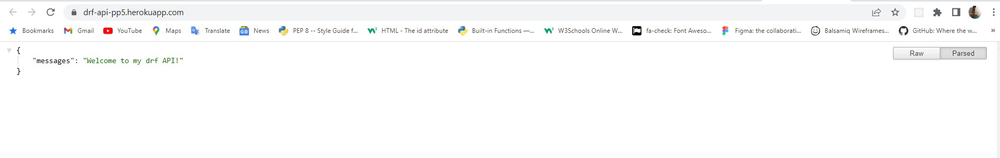

# FitnessBlogz - API

* * *

### ABOUT THE WEBSITE -

* * * 

[Live API Link](https://drf-api-pp5.herokuapp.com/)

[Github Repo](https://github.com/antoniog675/drf-api-pp5)

[Repo for FitnessBlogs PP5](https://github.com/antoniog675/drf-api-pp5)

[Deployed Site](https://fitness-blogz.herokuapp.com/)

The API that I have is going to be used to assist the 'FitnessBlogz' website with handling posts, profiles, comments, likes and followers.

What is the website? The website is going to be a 'Instagram' like website where users can share their workout routine, exercises, fitness progress and be able to like and comment on others posts to be able to support others on their fitness journey!

## Database

The User model is going to be the django default model - We will use user (PK) owner which will have a OneToOne relationship and on_delete=models.CASCADE.

User Model ---> id (BigAuto), username (Char) and password (Char)

Profile Model ---> id (BigAuto), owner (OneToOne), created_at (DateTime), updated_at (DateTime), name (Char), content, (Text), image (Image)

Followers Model ---> id (BigAuto), owner-following (ForeignKeyUser), followed (ForeignKeyUser), created_at (DateTime)

Comments Model ---> id (BigAuto), owner (ForeignKey), post(ForeignKey), created_at (DateTime), updated_at(DateTime), content (Text)

Post Model ---> id (BigAuto), owner (ForeignKey), created_at (DateTime), upadted_at(DateTime), title (Char), content(Text), image (Image)

Like Model ---> id (BigAuto), owner (ForeignKey), post (ForeignKey), created_at (DateTime)

## Testing

Tested profiles API, created 3 profiles and all three are stored, contains the users profile image, date createdm bio how many posts they have and how many followers they have and how many people they are following. URL link also goes to correct page

Profile 1 URL works, tested that this works for /2 and /3

All posts that have been created and uploaded are loaded

All comments that have been uploaded from most recent to oldest

All likes in website

Counts the number of profile that are following eachother

<ul>
    <li>Deleting posts removes it from the API, edited posts are also reflected in the backend</li>
    <li>Liking and unliking posts are reflected throughout the API, the number of likes on a post in the front end are the same as the number of likes in the backend </li>
</ul>

Here I have 2 screenshots, the first screenshot is an image of the posts that have been loaded up, received and displayed in the front end...

The 2nd screenshot is what the API is holding and as you can see they match, therefore the API is working..

## PEP8 -

I have manually gone through each file to check the warnings and have been correcting all of them, currently the only warnings from the settings file, if I try to break this code it completely breaks the API.

Same warnings as above, except in the env.py, if I try to make the line shorter it will break the API

## Technologies used - 

### Main Language -
<ul>
<li>Python</li>
</ul>

### Frameworks, Libraries and Programs used -
<ul>
<li>Django</li>
<li>Django RestFramework</li>
<li>Heroku</li>
<li>Pillow</li>
<li>Django Rest Auth</li>
<li>PostgresSQL</li>
<li>Cloudinary</li>
</ul>

## Deployment

- To be able to deploy the api on heroku we had to add an env.py and add somethings into the settings

- Heroku requires a Procfile in order for the site to be hosted online

The heroku app needs the config vars -
<ul>
    <li>ALLOWED_HOST</li>
    <li>CLIENT_ORIGIN</li>
    <li>CLIENT_ORIGIN_DEV</li>
    <li>CLOUDINARY_URL</li>
    <li>DATABASE_URL</li>
    <li>DISABLE_COLLECTSTATIC</li>
    <li>my_secret_key</li>
</ul>

In the drf_api settings we need to update INSTALLED_APPS with the apps we download-

-    'cloudinary_storage',
-   'django.contrib.staticfiles',
-  'rest_framework',
- 'rest_framework.authtoken',
-    'dj_rest_auth',
-    'django.contrib.sites',
-    'allauth',
-    'allauth.account',
-    'allauth.socialaccount',
-   'dj_rest_auth.registration',
-   'corsheaders',
-   'cloudinary',
-    'profiles',
-    'posts',
-    'comments',
-    'likes',
-    'followers',
-    'django_filters',

Then need to import the cloudinary storage -

CLOUDINARY_STORAGE = {
    'CLOUDINARY_URL': os.environ.get('CLOUDINARY_URL')
}
MEDIA_URL = '/media/'
DEFAULT_FILE_STORAGE = 'cloudinary_storage.storage.MediaCloudinaryStorage'

Create the REST_FRAMEWORK, and include page paginiation, pagination count and a date/time format

REST_FRAMEWORK = {
    'DEFAULT_AUTHENTICATION_CLASSES': [(
        'rest_framework.authentication.SessionAuthentication'
        if 'DEV' in os.environ
        else 'dj_rest_auth.jwt_auth.JWTCookieAuthentication'
    )],
    'DEFAULT_PAGINATION_CLASS':
        'rest_framework.pagination.PageNumberPagination',
    'PAGE_SIZE': 10,
    'DATETIME_FORMAT': '%d %b %Y',
}
if 'DEV' not in os.environ:
    REST_FRAMEWORK['DEFAULT_RENDERER_CLASSES'] = [
        'rest_framework.renderers.JSONRenderer',
    ]

I will set the default renderer to JSON-

if 'DEV' not in os.environ:
    REST_FRAMEWORK['DEFAULT_RENDERER_CLASSES'] = [
        'rest_framework.renderers.JSONRenderer',
    ]

Set the JWT tokens below - 

REST_USE_JWT = True
JWT_AUTH_SECURE = True
JWT_AUTH_COOKIE = 'my-app-auth'
JWT_AUTH_REFRESH_COOKIE = 'my-refresh-token'
JWT_AUTH_SAMESITE = 'None'

REST_AUTH_SERIALIZERS = {
    'USER_DETAILS_SERIALIZER': 'drf_api.serializers.CurrentUserSerializer'
}

Have my secret key set below -

SECRET_KEY = os.environ.get('my_secret_key')

Now in this part below, I will be giving permission to the heroku URL of the deployed FitnessBlogz link to communicate with the API.

ALLOWED_HOSTS = [
    os.environ.get('ALLOWED_HOST'),
    'localhost',
]

if 'CLIENT_ORIGIN' in os.environ:
    CORS_ALLOWED_ORIGINS = [
        os.environ.get('CLIENT_ORIGIN')
    ]

if 'CLIENT_ORIGIN_DEV' in os.environ:
    extracted_url = re.match(
        r'^.+-', os.environ.get('CLIENT_ORIGIN_DEV', ''), re.IGNORECASE
    ).group(0)
    CORS_ALLOWED_ORIGIN_REGEXES = [
        rf"{extracted_url}(eu|us)\d+\w\.gitpod\.io$",
    ]

CORS_ALLOW_CREDENTIALS = True

Have the wsgi for the Procfile -

WSGI_APPLICATION = 'drf_api.wsgi.application'

Update the database variable -

DATABASES = {
    'default': ({
        'ENGINE': 'django.db.backends.sqlite3',
        'NAME': BASE_DIR / 'db.sqlite3',
    } if 'DEV' in os.environ else dj_database_url.parse(
        os.environ.get('DATABASE_URL')
    ))
}

After these settings are done, I will migrate the database using -

- python3 manage.py makemigrations

- python3 manage.py migrate

Freeze requirements with -

pip3 freeze --local > requiremets.txt

And finally, git add, git commit, git push branch, and then I will navigate to heroku and go onto deploy, select the correct repo and deploy branch.

## Credits-

Credits to code institute for the walk through video in creating the API, and allowing me to use the project as a template to build my api for my PP5 project
